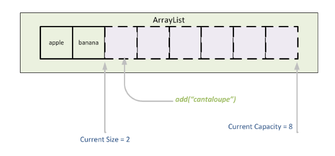

# Lists


* _Core Java: Volume I—Fundamentals_
  * 9.1, 9.2.1, 9.2.2, and 9.6.4


## Overview

Lists are a fundamental data structure in Java \(and other programming languages\) that allow us to store an ordered collection of objects. Lists preserve insertion order, allow for positional access, insertion, and deletion of elements, and permits duplicate values.

## Implementations

There are a number of concrete implementations of the `List` interface, including `ArrayList`, `LinkedList`, `Stack`, and `Vector`. Each implementation offers its own set of positives, as well as some drawbacks. We're going to take a look at three of the most popular.

### Array Lists

An `ArrayList` is essentially a dynamic array. It offers much of the same functionality as arrays without the capacity restrictions and resizing hassles.

Let's take a look at how these structures are created and used.

#### Constructors

To create an `ArrayList`, we use one of three constructors.

* `ArrayList()`
* `ArrayList(int initialCapacity)`
* `ArrayList(Collection<? extends E> c)`

Documentation is big part of being a software developer. There's no hand-holding in the real world. When presented with a new technology or programming language, you'll be expected to consult the documentation to familiarize yourself with it.

Time to step into the real world. Check out [the documentation](https://docs.oracle.com/en/java/javase/11/docs/api/java.base/java/util/ArrayList.html) to see how these constructors work with the `ArrayList` class. You'll soon be asked to build your own from scratch!

#### Methods

An `ArrayList` provides a number of operations \(many more than you'll probably need in this course\). We're going to focus on some of the more commonly used ones.

* `add(int index, E element)`
* `add(E e)`
* `clear()`
* `contains(Object o)`
* `get(int index)`
* `indexOf(Object o)`
* `isEmpty()`
* `remove(int index)`
* `remove(Object o)`
* `removeRange(int fromIndex, int toIndex)`
* `set(int index, E element)`
* `size()`
* `trimToSize()`

That's quite a few methods with which you'll need to familiarize yourself. You know what that means. Back to [the documentation](https://docs.oracle.com/en/java/javase/11/docs/api/java.base/java/util/ArrayList.html)...and then on to your first problem set!



### Linked Lists

A `LinkedList` stores data in a list, but does so in a way that's much different than an `ArrayList`. Rather than indexed slots, each item in a `LinkedList` keeps track of the next item in the list. It forms what effectively becomes a chain of connection elements.

There are a few variations of a `LinkedList`, which involve how and in what ways each item \(often called a node\) is linked.

#### Singly Linked Lists

In a singly linked list, each node contains a reference to the next node in the list \(i.e., moving left to right\).

To put this into Java terms, the node would be its own class with two instance variables: the data and the reference to the next node.

#### Doubly Linked Lists

As you might've guessed, a doubly linked list has bidirectional references. Each node has a reference to both the next and previous node in the list.

Again, the node would represent a Java class. Like the singly linked list, it would have an instance variable for the data and two for the bidirectional references \(of next and previous\).

#### Circular Linked Lists

A circular linked list is one in which the last element contains a reference to the first. Technically, this is called a circular singly linked list.

A circular doubly linked list would have these circular connections in both directions. The first item would reference the last, and the last item would reference the first.

Now, let's take a look at some common operations.

#### Constructors

To create a `LinkedList`, we use one of two constructors.

* `LinkedList()`
* `LinkedList(Collection<? extends E> c)`

Having read through the `ArrayList` documentation, it shouldn't be hard to guess what these two do. To be sure, though, let's [check it out](https://docs.oracle.com/en/java/javase/11/docs/api/java.base/java/util/LinkedList.html). Things move fast around here. Another problem set coming at you!



#### Methods

Like last time, let's go through some of the more commonly used `LinkedList` methods.

* `add(int index, E element)`
* `addFirst(E e)`
* `addLast(E e)`
* `clear()`
* `contains(Object o)`
* `get(int index)`
* `getFirst()`
* `getLast()`
* `indexOf(Object o)`
* `remove(int index)`
* `remove(Object o)`
* `removeFirst()`
* `removeFirstOccurrence()`
* `removeLast()`
* `removeLastOccurrence()`
* `set(int index, E element)`
* `size()`

The more experience you have with list structures, the more self-explanatory these methods become. It's alright if they're not even a little bit self-explanatory. That's what [documentation](https://docs.oracle.com/en/java/javase/11/docs/api/java.base/java/util/LinkedList.html) is for!

### Stacks

A `Stack` is a last-in-first-out \(LIFO\) data structure, meaning that the most recently added items are the first available. And, conversely, the first items to be added to a `Stack` will be the last ones taken off of it.

You know the drill. Let's look at some constructors and methods.

#### Constructors

There's just one way to create a `Stack`.

* `Stack()`

Pretty simple, right? The only available constructor creates an empty stack.

#### Methods

A `Stack` is a much simpler data structure compared to an `ArrayList` and `LinkedList`. There are only five operations that need to be supported.

* `empty()`
* `peek()`
* `pop()`
* `push(E item)`
* `search(Object o)`

These aren't as easily recognizable by name, so it'll take some poking around [the documentation](https://docs.oracle.com/en/java/javase/11/docs/api/java.base/java/util/Stack.html) to understand what they're expected to do. Let's wrap up Lists with yet another problem set.



