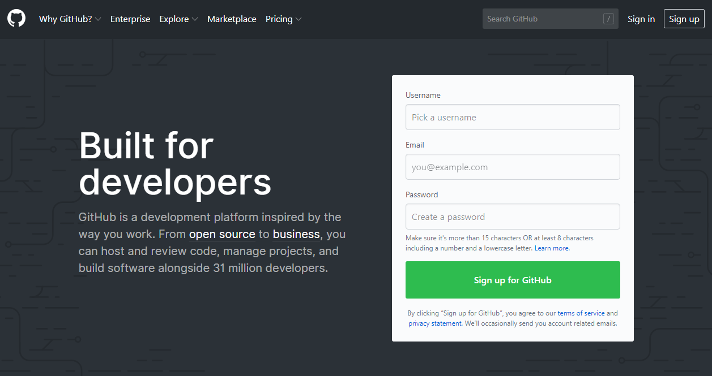
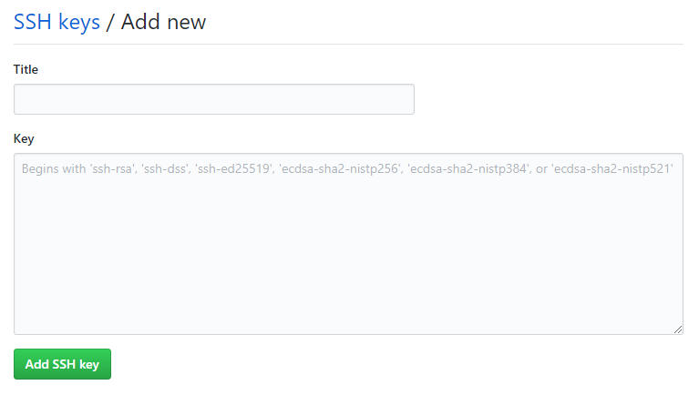

# Our Programming Environment

## Installing the JDK

The Java Development Kit \(JDK\) is a collection of tools you need to create, debug, and run Java programs. The Java Runtime Environment \(JRE\) is included in the JDK, and is responsible for executing Java programs. It does this via the Java virtual machine \(JVM\), which can interpret the code you've written and compiled. The JDK is a superset of the JRE; it contains everything the JRE does, plus tools for compiling and debugging your programs.

To get started, navigate to [Oracle's Java SE downloads](https://www.oracle.com/java/technologies/javase-jdk11-downloads.html). Find the latest LTS release, which at the time of writing is Java 11, and download it. Much of this section is operating system-specific, so make sure you're following instructions that pertain to your system. If you're running a Linux distribution, I'm going to assume you have the technical prowess to setup your environment without the handholding.





To verify the success of your installation, open the Command Prompt and enter the `java` command, followed by the `--version` flag.

```text
C:\> java --version
java version "11.0.7" 2020-04-14 LTS
Java(TM) SE Runtime Environment 18.9 (build 11.0.7+8-LTS)
Java HotSpot(TM) 64-Bit Server VM 18.9 (build 11.0.7+8-LTS, mixed mode)

C:\>
```

Check the compiler version, too, using the `javac` command. It's important that the version numbers between `java` and `javac` match exactly.

```text
C:\> javac --version
javac 11.0.7

C:\>
```

#### Adjusting the `PATH`

There are two circumstances that typically require you to adjust your `PATH` variable.

1. `java` or `javac` isn't recognized at all, or
2. `java` and `javac` are recognized, but reporting different versions.

```text
C:\> java --version
'java' is not a recognized internal or external command,
operable program or batch file.

C:\>
```

Follow [these steps](%20https://mkyong.com/java/how-to-set-java_home-on-windows-10/) to remedy this situation. Close the Command Prompt, reopen it, and re-run the `java --version` and `javac --version` commands to verify all is well.





To verify the success of your installation, open the Terminal and enter the `java` command, followed by the `--version` flag.


Check the compiler version, too, using the `javac` command. It's important that the version numbers between `java` and `javac` match exactly.


#### Adjusting the `PATH`

There are two circumstances that typically require you to adjust your `PATH` variable.

1. `java` or `javac` isn't recognized at all, or
2. `java` and `javac` are recognized, but reporting different versions.

To remedy this, open your `.bash_profile` file using Vim.


Vim is a bare-bones text editor built right into the Terminal. It's a bit tricky to use, but there are plenty of online tutorials if you're interested in learning more. For now, press the `i` key to enter `-- INSERT --` mode and enter the following lines.


Be sure to check your installation path, as it may not be exactly the same as mine.

Press `esc` to leave `-- INSERT --` mode, and type `:wq` to save and exit. Enter the following command to force the changes to take effect.


Re-run the `java --version` and `javac --version` commands. They should now be recognized and reporting identical versions.



## Version Control with Git

Version control, more generally, is the process by which developers track changes to project files over time. You can think of this like the version history feature in Google Docs. It affords you the opportunity to revert to a prior working state in the event you mess something up. When working on a team, you can keep track of who made what changes. It may not seem like it, but something like this is very useful.

Git is one of several powerful version control systems. It handles the job of tracking newly created files, changes to existing files, and deleted files. Like anything worth knowing or doing, there's a bit of a learning curve. At first, you'll want to pull your hair out. Trust me, though. There's a reason every software developer in the world uses some variation of this to manage their codebases. It's well worth learning.



Git, the version control system software, was originally written for the Linux operating system. Git for Windows ports the Git functionality over to the Windows operating system.



After the installation is complete, open up the Git Bash window through the Start menu. It looks a lot like a Command Prompt, and it's where you'll enter all of your Linux and Git commands needed to interact with and manipulate your files, folders, and applications. Like it or not, you're going to get very comfortable working from the command line.





If you're running Mavericks \(10.9\) or later, it's incredibly simple to install Git. To do so, you just need to install the Xcode Command Line Tools. Open the Terminal and run the following command. If you receive a response reporting your Git version, then you already have the Xcode Command Line Tools installed.


Otherwise, you'll be prompted to install them. Click Install, accept the license agreement, and hang tight. It's a fairly quick installation.


When it's finished, click Done and re-run the `git --version` command. It doesn't matter if your version doesn't match mine. It very well may be more recent!



## Hosting with GitHub

GitHub is Google Drive for programmers—it provides repositories where you can store your projects remotely. This is a great way to backup your code in case something happens to your local copy. More importantly, though, it lets you keep your local copies in sync when working across different devices.

Navigate to [Github](https://github.com/). If you have an existing account, you're welcome to use it. Otherwise, choose a username, email, and password, and sign up. A word to the wise—the district spam filters love to hold GitHub confirmation emails hostage. A personal email is a better choice, at least in the beginning.



If privacy is a concern, you can always hide your email address from the public. I'll go over this in the Personal Settings section.

### Personal Settings

When you first login, you'll see a square, pixelated icon in the top-right corner of the page. Click it, and then select Settings. Yours will look a little different than mine, but you should see something to this effect. This is your Public profile.


In the Personal settings menu on the left, you can explore different configurations for your account. It's unlikely you'll need to worry about most of these sections, but here are the highlights of each.

* Profile - general biographical information.
* Account - username and password changes; account deletion.
* Emails - add and remove email address\(es\); make an email private.
* Notifications - configure email notifications.
* Billing - upgrade to paid plans; manage payment methods.
* SSH and GPG keys - add authentication key\(s\) for your computer\(s\).
* Security - manage two-factor authentication.
* Sessions - view a list of active sessions.
* Blocked users - block specific users from interacting with you on GitHub.
* Repositories - view a list of your repositories.
* Organizations - view a list of your member organizations.
* Saved replies - create reusable snippets for GitHub comments.
* Applications - view applications with permission to access your account.

If you're still panicking about your personal email being visible to the world, here's where we're going to fix that. Click Emails. You can add or remove emails, and configure your preferences however you'd like. Check this box to hide your emails from the prying eyes of the cyber world.


Most sections have some sort of save button at the bottom, so make sure you click this to persist your changes.

### Setting up an SSH Key

Before you can meaningfully use GitHub, you'll need to establish a connection between your computer and your account. To do that, you have to create and add an SSH key to your account.

An SSH key is a means by which your computer can identify itself to the GitHub servers. SSH keys come in pairs—a public key and private key. The public key is shared with GitHub, while the private key is stored locally on your computer. When you try to access GitHub, a "handshake" takes place between your computer and GitHub's servers. During this handshake, you are only granted access if the public/private key pair matches.

To start this process, enter the following command. Make sure you replace `rwilson@ucvts.org` with your actual email address, which should match the one you used to create your GitHub account.


It'll run you through a series of prompts, first asking you to enter the file in which you want to save your public/private key pair. Unless you have a really good reason for doing so, accept the default location by pressing `Enter` without typing any other text.


Next, you'll be asked to enter a password. You can leave this blank, too. Press `Enter`.


Like most systems, you'll be asked to confirm the password you entered. If you left it blank the first time, leave it blank this time, too. If you chose to enter a password, confirm it.


The strange little graphic you're seeing is called a randomart image, and it means your public/private key pair was successfully generated. You'll have two files: one with a `.pub` extension, and one without. The one with the `.pub` is your public key. You should never share your private key.


Use the following command to copy the contents of your public key. This assumes you accepted the default location for your public/private key pair earlier. If you chose a custom location, you'll need to modify this command accordingly.


Since I'm on a Mac and most of you are using Windows, there are a few differences in some of the commands. This is one of those uncommon occasions. Windows users should use this copy command.

```text
clip < ~/.ssh/id_rsa.pub
```

#### Copying the Key to GitHub

That wasn't too hard, right? Now, you just have to paste it into the appropriate section of your GitHub account settings. Click SSH and GPG keys in the Personal settings menu, then click New SSH key. Choose a suitable title that describes the computer you're using \(especially if you plan on generating multiple keys from multiple devices\) and enter this in the title field. Then, paste the contents of your public key in the key field.



Click Add SSH key, and you're all set.

## Installing Eclipse

Eclipse a full-featured integrated development environment \(IDE\). It's one of many, and I'm sure some of you can make an argument for or against using it. It doesn't need to become your favorite editor, but you should be comfortable enough working with it.

Eclipse is a pretty straightforward download regardless of operating system. [Grab the installer that matches your OS](https://www.eclipse.org/downloads/), follow along with the point-and-click wizard, and you're all set!











Later, we'll add a few more components to our development environment. For now, though, we're ready to start coding. Let's dive in!

