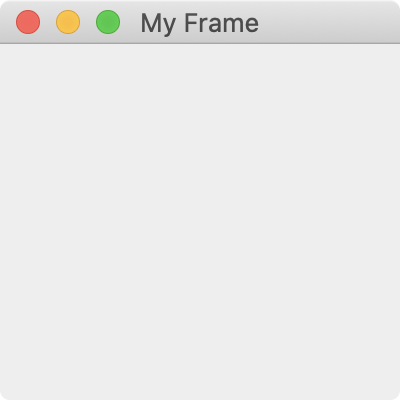

# Containers


* _Core Java: Volume I—Fundamentals_
  * 10, 11, and 12
* [Trail: Creating a GUI with JFC/Swing](https://docs.oracle.com/javase/tutorial/uiswing/index.html)


## Frames and Panels

We're all familiar with the concept of frames, even if you don't know it yet. We've all worked with a variety of applications—web browsers, Microsoft Office tools, or even Eclipse. You click the icon to launch the program, and a little window opens. This window is known in Java as a frame. More specifically, it's known as a `JFrame`.

### Frames

A `JFrame` is a built-in class in Java. It's part of the Swing toolkit, which provides many graphical user interface components. A `JFrame` functions as a window, and it's the container inside of which you'll put all of your components and content.

We can write a few simple lines of code to create and show our first frame.

```java
import javax.swing.JFrame;

public class FrameDemo {

    public static void main(String[] args) {
        JFrame frame = new JFrame("My Frame");    // create frame, give title
        frame.setSize(200, 200);                  // set dimensions
        frame.setVisible(true);                   // make frame visible
    }
}
```

This will create a simple \(and empty\) frame. Yours may look a bit different, as Java uses the native look-and-feel of the operating system. I'm using a Mac, so it looks like a Mac window.



There are a number of settings and configurations we can tweak to customize the behavior of our frame. You can check out a few of them in [the Java Tutorials from Oracle](https://docs.oracle.com/javase/tutorial/uiswing/components/frame.html).

### Panels

We're going to put other components inside of our frame. It's helpful to be able to group those together, too. Java provides another class called `JPanel`, which allows us to group components together before being added to the overall frame.

Let's write a few more lines of code to add a couple `JPanel`s to our `JFrame`.

```java
import java.awt.BorderLayout;
import java.awt.Color;

import javax.swing.BorderFactory;
import javax.swing.JButton;
import javax.swing.JFrame;
import javax.swing.JPanel;

public class PanelDemo {

    public static void main(String[] args) {
        JFrame frame = new JFrame("My Frame");
        
        JPanel top = new JPanel();
        JButton topOne = new JButton("Top One");
        JButton topTwo = new JButton("Top Two");
        
        JPanel bottom = new JPanel();
        JButton bottomOne = new JButton("Bottom One");
        JButton bottomTwo = new JButton("Bottom Two");
        
        top.add(topOne);
        top.add(topTwo);
        top.setBorder(BorderFactory.createLineBorder(Color.RED));
        
        bottom.add(bottomOne);
        bottom.add(bottomTwo);
        bottom.setBorder(BorderFactory.createLineBorder(Color.BLUE));
        
        frame.add(top, BorderLayout.NORTH);
        frame.add(bottom, BorderLayout.SOUTH);
        frame.setSize(400, 200);
        frame.setVisible(true);
    }
}
```

A bit more complicated, and we're using components and packages we haven't seen before \(namely, `JButton`, `BorderFactory`, and `BorderLayout`\). Don't worry, we'll get to those in due time.


In the next section, we'll see how to make your buttons actually do something when they're clicked. For now, it's important we have a solid understanding how why and how we use panels. Again, [the Java Tutorials](https://docs.oracle.com/javase/tutorial/uiswing/components/panel.html) go into this a bit more detail.

