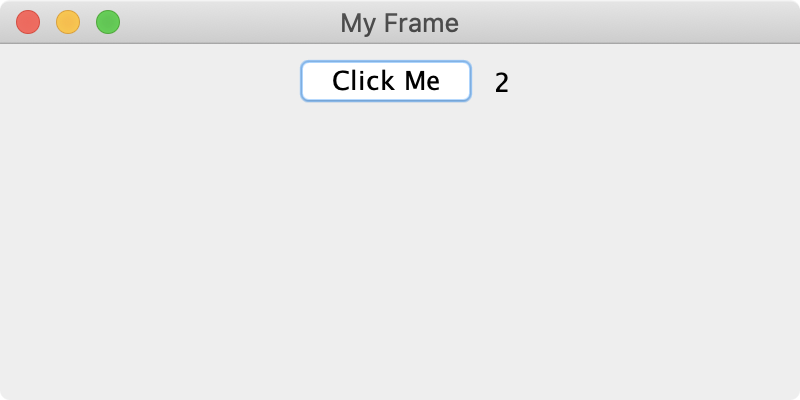
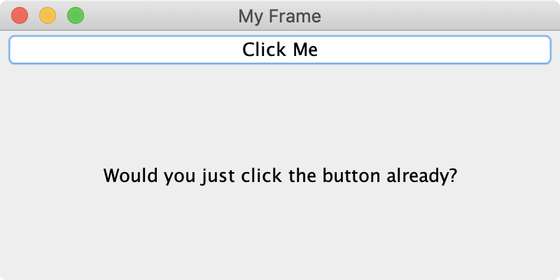

# Event Handling


* _Core Java: Volume I—Fundamentals_
  * 10, 11, and 12
* [Trail: Creating a GUI with JFC/Swing](https://docs.oracle.com/javase/tutorial/uiswing/index.html)


## Listeners

You'll likely spend a lot of time laying out your components inside of panels and frames. If you're a perfectionist like me, you'll want everything exactly in its place. That's all well and good, but looks aren't everything. Our users are going to want to interact with our interfaces. There are a number of listeners that allow our GUI components to respond to certain actions a user might take.

## Action Listeners

An action listener is one of the most common event handlers you'll need to implement. We use action listeners to define how our program should respond when a user performs an action, such as clicking a button, choosing a menu item, or selection a checkbox or radio button.

Whenever the user performs an action, Java sends out what is called an `actionPerformed` message. Any action listeners registered with the component can then respond to the action. Let's use a simple button click as an example.

```java
import java.awt.event.ActionEvent;
import java.awt.event.ActionListener;

import javax.swing.JButton;
import javax.swing.JFrame;
import javax.swing.JLabel;
import javax.swing.JPanel;

/**
 * Our ActionDemo class implements the ActionListener interface.
 * There's just one method in the ActionListener interface, and
 * it's called actionPerformed. It responds to actions the user
 * takes on our GUI components. Since we're implementing this
 * interface, it's our job to implement this method.
 */
 
public class ActionDemo implements ActionListener {
    
    private int clicks;        // tracks the number of clicks
    private JButton button;    // button triggers updates to clicks
    private JLabel label;      // label displays clicks
    
    /**
     * Creates an instance of the ActionDemo class, initially
     * setting clicks to 0.
     */
     
    public ActionDemo() {
        this.clicks = 0;
    }
    
    /**
     * It's bad practice to do all our GUI initialization in the
     * main method, so we move it to a separate instance method.
     */
     
    public void createAndShowGui() {
        JFrame frame = new JFrame("My Frame");    // create frame
        JPanel panel = new JPanel();              // create panel
        button = new JButton("Click Me");         // create button
        
        // create label with an initial text value of 0, which
        // is derived from the value of clicks
        
        label = new JLabel(String.valueOf(clicks));
        
        // this is an important part: registering the action listener.
        // we pass in this (which refers to this class) because this
        // class is implementing (and therefore acting as) the
        // action listener. when the button is clicked, the
        // actionPerformed method in this class will be called.
        
        button.addActionListener(this);
        
        panel.add(button);    // add button to panel
        panel.add(label);     // add label to panel
        
        frame.add(panel);            // add panel to frame
        frame.setSize(400, 200);     // set frame size
        frame.setVisible(true);      // show frame
    }

    /*
     * This method will be called when the button is clicked.
     */
     
    @Override
    public void actionPerformed(ActionEvent e) {
    
        // first, we get the source of the action. in this example,
        // this is redudant. the only possibly source component is
        // our button. however, in a class with more than one button,
        // this is how we'd determine which button was clicked.
        
        Object source = e.getSource();
        
        // if the source is equal to our button, then we update the label.
        
        if (source.equals(button)) {            
            label.setText(String.valueOf(++clicks));    // update label
        }
        
        // remember, if we have more than one button, we need to be
        // able to determine which button was clicked. for example:
        //
        // if (source.equals(firstButton)) {
        //     labelOne.setText("blah");
        // } else if (source.equals(secondButton)) {
        //     labelTwo.setText("blah blah");
        // }
    }
    
    /**
     * As always, our main method kicks of program execution.
     */
     
    public static void main(String[] args) {
        new ActionDemo().createAndShowGui();
        
        // we only need an ActionDemo object to call the
        // createAndShowGui method. this is the shorthand
        // equivalent of doing this:
        //
        // ActionDemo demo = new ActionDemo(); 
        // demo.createAndShowGui();
    }
}
```

This is a pretty simple program. It's got a `JLabel` and `JButton`, and clicking the `JButton` updates the text of the `JLabel`. I've commented this program thoroughly to help you follow along with what I'm doing and why. Here's what it would look like after it was launched and the user clicked the button twice.



Check out [the Java Tutorials](https://docs.oracle.com/javase/tutorial/uiswing/events/actionlistener.html) for even more on action listeners.

## Mouse Listeners

TODO

```java
import java.awt.BorderLayout;
import java.awt.event.KeyEvent;
import java.awt.event.KeyListener;
import java.awt.event.MouseEvent;
import java.awt.event.MouseListener;

import javax.swing.JButton;
import javax.swing.JFrame;
import javax.swing.JLabel;
import javax.swing.JPanel;
import javax.swing.SwingConstants;

/**
 * Our MouseDemo class implements the MouseListener interface. There
 * are five methods in the MouseListener interface, and they're
 * called mouseClicked, mousePressed, mouseReleased, mouseEntered, and
 * mouseExited. They respond to various phases of the user clicking or
 * or moving the mouse. Since we're implementing this interface, it's
 * our job to implement these methods.
 */
 
public class MouseDemo implements MouseListener {
    
    private JButton button;
    private JLabel label;
    
    /**
     * It's bad practice to do all our GUI initialization in the
     * main method, so we move it to a separate instance method.
     */
     
    public void createAndShowGui() {
        JFrame frame = new JFrame("My Frame");    // create frame
        JPanel panel = new JPanel();              // create panel
        
        // create a button whose text will change based on whether
        // or not the user is hovering the mouse over it.
        
        button = new JButton("Click Me");
        
        // create label with an initial text value of Go ahead and.
        // click the button. When the user hovers over the button,
        // this text will change. When the user stops hovering, it'll
        // change back.
        
        label = new JLabel(
            "Go ahead and click the button.",
            SwingConstants.CENTER
        );
        
        // this is an important part: registering the mouse listener.
        // we pass in this (which refers to this class) because this
        // class is implementing (and therefore acting as) the
        // mouse listener. when the user hovers (or stops hovering)
        // over the button, the associated mouse listener methods in
        // this class will be called.
        
        button.addMouseListener(this);
        
        panel.setLayout(new BorderLayout());    // set a layout
        panel.add(button, BorderLayout.NORTH);  // add button to top of panel
        panel.add(label, BorderLayout.CENTER);  // add label to middle of panel
        
        frame.add(panel);            // add panel to frame
        frame.setSize(400, 200);     // set frame size
        frame.setVisible(true);      // show frame
    }
    
    /**
     * We can detect individual mouse clicks with this method. In the
     * context of a JButton, clicks would be handled by an ActionListener,
     * but there might be instances where we want to capture clicks
     * of components that aren't buttons.
     */
    
    @Override
    public void mouseClicked(MouseEvent e) {
        // unimplemented
    }
    
    /**
     * This is the first half of a mouse click event. It's the part
     * where the user presses the mouse down.
     */

    @Override
    public void mousePressed(MouseEvent e) {
        // unimplemented
        
    }
    
    /**
     * This is the second half of a mouse click event. It's the part
     * where the user releases the mouse.
     */
    
    @Override
    public void mouseReleased(MouseEvent e) {
        // this is the second half of a click event. it's the action
        // of releasing the mouse
        
    }

    /**
     * You can think of this like a hover effect in CSS. It detects
     * when the mouse enters the bounds of a component.
     */
    
    @Override
    public void mouseEntered(MouseEvent e) {
        Object source = e.getSource();
        
        // if the mouse is hovering over the button, update label text
        
        if (source.equals(button)) {
            label.setText("Would you just click the button already?");
        }
    }
    
    /**
     * Again, this is like the hover effect in CSS, except it's when
     * the user stops hovering over a component.
     */

    @Override
    public void mouseExited(MouseEvent e) {
        Object source = e.getSource();
        
        // if the mouse is no longer hovering over the button, revert
        // label text back to original value
        
        if (source.equals(button)) {
            label.setText("Go ahead and click the button.");
        }
    }
    
    public static void main(String[] args) {
        new MouseDemo().createAndShowGui();
    }
}
```

This is a pretty simple program. It has only a `JLabel` and a `JButton`. The label is updated whenever the user hovers \(or stops hovering\) over the button. I've commented this program thoroughly to help you follow along with what I'm doing and why. Here's what it would look like after it was launched and the user hovered over the button.



Check out [the Java Tutorials](https://docs.oracle.com/javase/tutorial/uiswing/events/mouselistener.html) for even more on mouse listeners. There's a different, but related, listener for mouse motion that you might want to [check out](https://docs.oracle.com/javase/tutorial/uiswing/events/mousemotionlistener.html), too.

## Key Listeners

A key listener listens for a different type of action. Specifically, it listens for and responds to the user typing on the keyboard. It's common to see these in use when you have fields designed to accept character-based input.

While we won't be using a text box in this example, we'll take a look at the basic functionality that key listeners provide.

```java
import java.awt.event.KeyEvent;
import java.awt.event.KeyListener;

import javax.swing.JFrame;
import javax.swing.JLabel;
import javax.swing.JPanel;

/**
 * Our KeyDemo class implements the KeyListener interface. There
 * are three methods in the KeyListener interface, and they're
 * called keyTyped, keyPressed, and keyReleased. They respond to
 * various phases of the user hitting a key on the keyboard.
 * Since we're implementing this interface, it's our job to
 * implement these methods.
 */
 
public class KeyDemo implements KeyListener {
    
    private JLabel label;
    
    /**
     * It's bad practice to do all our GUI initialization in the
     * main method, so we move it to a separate instance method.
     */
     
    public void createAndShowGui() {
        JFrame frame = new JFrame("My Frame");    // create frame
        JPanel panel = new JPanel();              // create panel
        
        // create label with an initial text value of Key Pressed.
        // when the user types keys later, this text will change
        // accordingly.
        
        label = new JLabel("Key Pressed: ");
        
        // this is an important part: registering the key listener.
        // we pass in this (which refers to this class) because this
        // class is implementing (and therefore acting as) the
        // key listener. when the button is clicked, the associated
        // key listener methods in this class will be called.
        
        frame.addKeyListener(this);
        
        panel.add(label);    // add label to panel
        
        frame.add(panel);            // add panel to frame
        frame.setSize(400, 200);     // set frame size
        frame.setVisible(true);      // show frame
    }
    
    /**
     * Called immediately after a user types a Unicode character.
     */
    
    @Override
    public void keyTyped(KeyEvent e) {
        label.setText("Key Pressed: " + e.getKeyChar());    // upate label
    }

    /**
     * Called immediately after a user pressed a key down.
     */
    
    @Override
    public void keyPressed(KeyEvent e) {
    
        // we're not actually doing this, but here's an example of
        // when we might use this over the keyTyped method.
        
        if (e.getKeyCode() == KeyEvent.VK_SHIFT) {
            // the Shift button doesn't have a Unicode value, so
            // just pressing the Shift button won't be picked up
            // by the keyTyped method. we can respond to this
            // (and other special keys) in this method.
        }
    }

    /**
     * Called immediately after a user releases a previously pressed key.
     */
    
    @Override
    public void keyReleased(KeyEvent e) {
        // unimplemented, but there might be unique cases where
        // you specifically need to wait for a user to release a
        // a key to do something. maybe you're making a game
        // where something happens while a certain key is pressed,
        // and that something needs to stop happening whenever
        // the key is released.
    }
    
    /**
     * As always, our main method kicks of program execution.
     */
     
    public static void main(String[] args) {
        new KeyDemo().createAndShowGui();
    }
}
```

This is a pretty simple program. It has only a `JLabel`, which is updated whenever the user presses a key on the keyboard. I've commented this program thoroughly to help you follow along with what I'm doing and why. Here's what it would look like after it was launched and the user pressed `Shift + A`.


Check out [the Java Tutorials](https://docs.oracle.com/javase/tutorial/uiswing/events/keylistener.html) for even more on key listeners.

