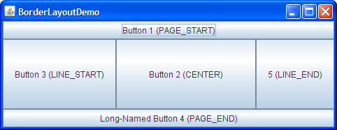
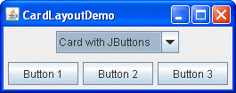
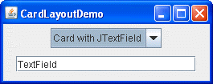
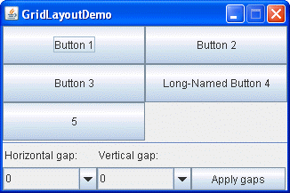

# Layout Management


* _Core Java: Volume I—Fundamentals_
  * 10, 11, and 12
* _Core Java: Volume II—Advanced Features_
  * 10
* [Trail: Creating a GUI with JFC/Swing](https://docs.oracle.com/javase/tutorial/uiswing/index.html)
* [A Visual Guide to Layout Managers](https://docs.oracle.com/javase/tutorial/uiswing/layout/visual.html)


## Laying out an Application

The biggest task when it comes to creating a graphical user interface is the layout. Where are you going to put each of your components relative to the window, as well as relative to each other? As a UI designer, this is your number one responsibility.

Java isn't the best language in which to write UIs, and we'll later transition away from Java as our frontend technology \(though we'll stick with it for the backend\). Some developers opt for more fine-grained control, while others choose to use layout managers to handle a lot of the heavy lifting for them.

## Popular Layout Managers

You're free to go with whichever strategy you like, but you should at least understand how some of the more popular layout managers work.

### BorderLayout

`BorderLayout` is a built-in class in Java that let's you structure your layout using directional commands \(i.e., north, south, east, west\). Based on the directional command applied to a component \(or group of components\), the layout manager handles the relative positioning accordingly.

`BorderLayout.NORTH` positions components at the top of the window. Likewise, `BorderLayout.SOUTH` refers to the bottom. And as you can imagine, `BorderLayout.EAST` and `BorderLayout.WEST` associate content with the right and left of the panel, respectively.

We saw a couple instance of `BorderLayout` in some of the earlier examples.

### CardLayout

`CardLayout` serves as more of top-level layout manager. It doesn't do as much in the way of laying out components in a panel \(like BorderLayout does\), but it does give you the ability to conditionally show an entire view.

A lot of times, the view that is shown is dependent on a menu of some sort. However, and as you'll see, we can just as easily show \(or hide\) views based on other actions the user might take.

### GridLayout

A `GridLayout` does exactly what it sounds like it might do. It creates a grid of squares of equal height and width, and allows you to put components in those cells.

If you have tabular data, it makes a lot of sense to render it using a `GridLayout`. It really helps to go through the visual guide. There are code samples that you can experiment with and run.

